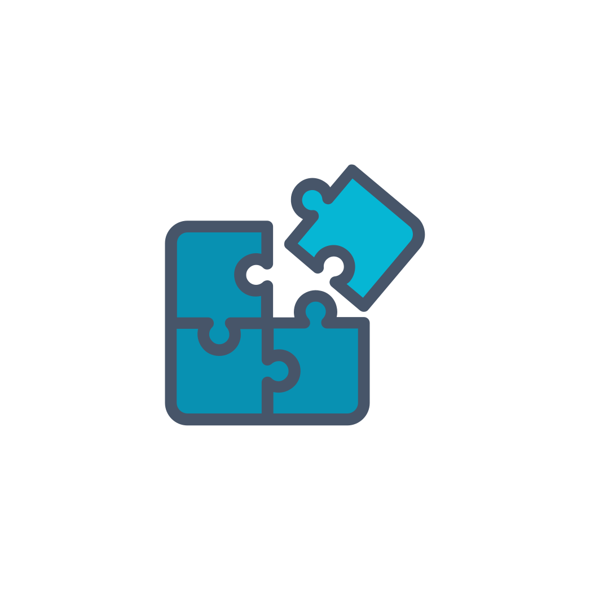
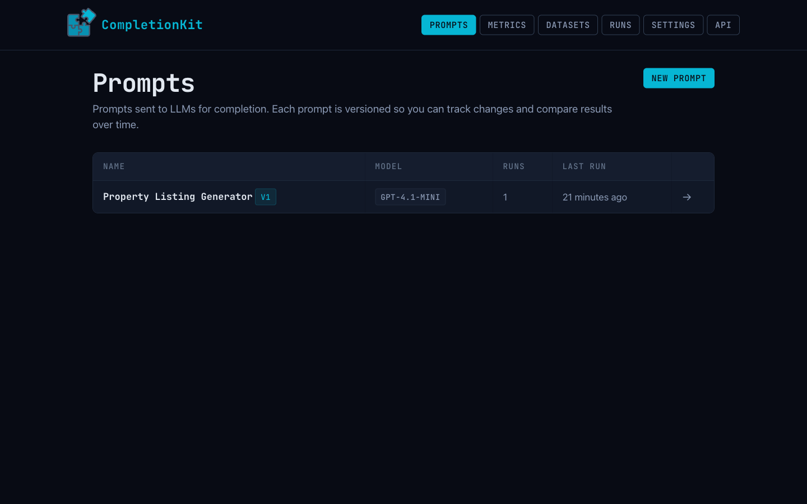
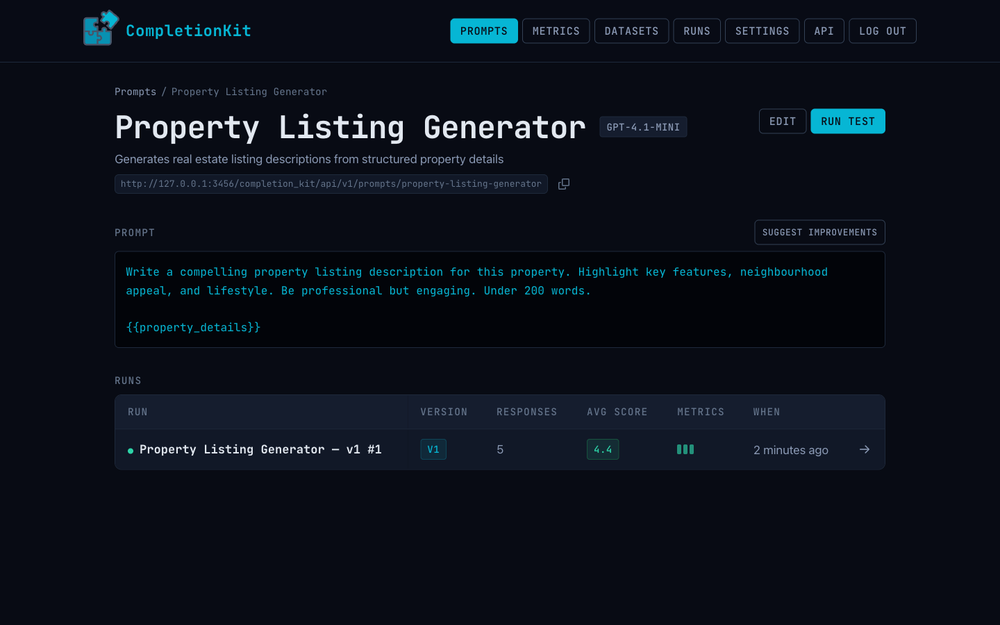
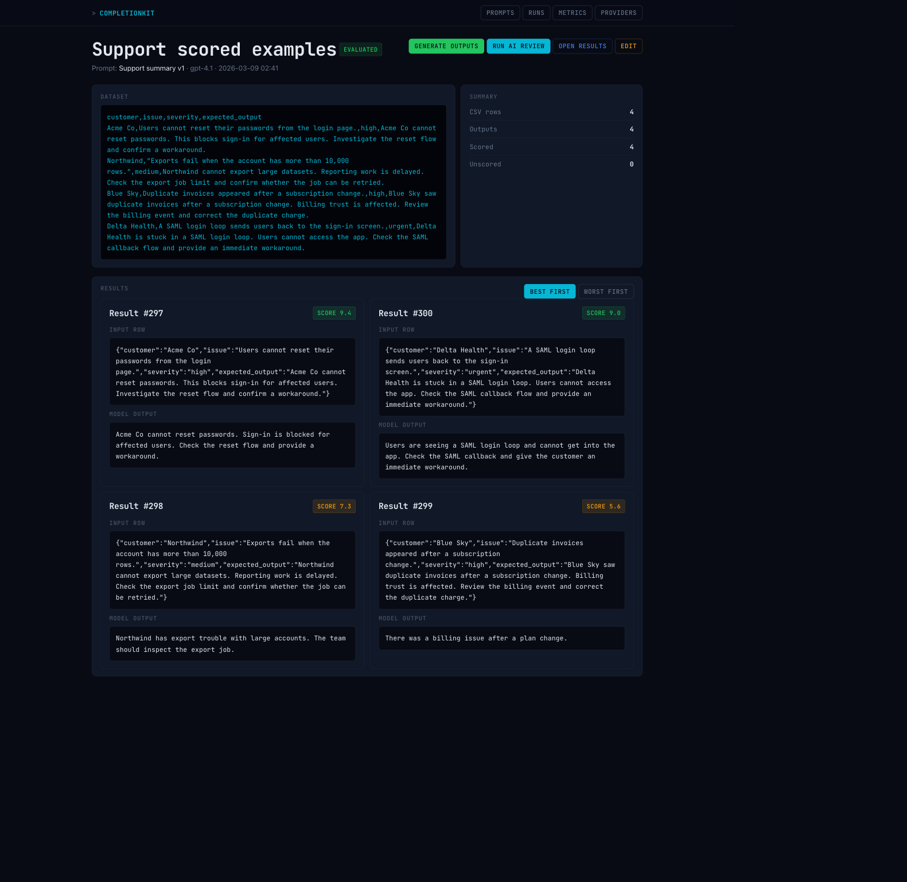

<p align="center">
  
</p>

# CompletionKit

[](https://github.com/homemade-software-inc/completion-kit/actions/workflows/ci.yml)


[](https://github.com/homemade-software-inc/completion-kit/network/updates)

You need to know whether your prompts produce the output you expect, consistently, across real data. CompletionKit gives you that, inside your Rails app.

Mount the engine, bring your prompts and datasets, and every input runs through a model you pick. Each output is scored against your own metrics and rubrics by an LLM-as-judge. When you change a prompt, re-run the same dataset and see exactly what got better and what broke — and when the scores tell you something's off, CompletionKit can suggest an improved version of the prompt based on the reviews, which you inspect as a diff and apply as a new version.

Drive it from the web UI, from the REST API, or from Claude Code and other MCP-aware agents via the built-in Model Context Protocol server. All three share the same state — your prompts, runs, datasets, and scores are one source of truth.

It's the difference between "this prompt seems to work" and "this prompt scores 4.3 out of 5 across 200 inputs, up from 3.8 last version."







## Setup

```ruby
gem "completion-kit"
```

```bash
bin/rails generate completion_kit:install
bin/rails db:migrate
```

Set your provider keys via environment variables or the generated initializer:

```bash
OPENAI_API_KEY=...
ANTHROPIC_API_KEY=...
LLAMA_API_KEY=...
LLAMA_API_ENDPOINT=...
```

Available models are discovered dynamically from each provider's API.

### Encryption keys

Provider API keys are stored using [Rails Active Record encryption](https://guides.rubyonrails.org/active_record_encryption.html), so the host app must have encryption keys configured. If you haven't set them up already:

```bash
bin/rails db:encryption:init
```

Copy the generated keys into `config/credentials.yml.enc` under `active_record_encryption`, or set the equivalent environment variables. CompletionKit won't boot without valid keys in production.

## Authentication

CompletionKit requires authentication in production. In development, routes are open by default (with a log warning).

### Basic Auth (recommended for simple setups)

```ruby
# config/initializers/completion_kit.rb
CompletionKit.configure do |c|
  c.username = "admin"
  c.password = ENV["COMPLETION_KIT_PASSWORD"]
end
```

### Custom Auth (Devise, etc.)

```ruby
# config/initializers/completion_kit.rb
CompletionKit.configure do |c|
  c.auth_strategy = ->(controller) { controller.authenticate_user! }
end
```

Only one mode can be active — setting both raises a `ConfigurationError`.

## Usage

1. Create a prompt with `{{variable}}` placeholders
2. Create a test run and paste CSV data (headers match variable names)
3. Generate outputs, run AI review, inspect scored results

## Programmatic access

CompletionKit exposes every resource through both a REST JSON API and an MCP server. Both share the same bearer-token auth, so configure once and use either interface:

```ruby
# config/initializers/completion_kit.rb
CompletionKit.configure { |c| c.api_token = ENV["COMPLETION_KIT_API_TOKEN"] }
```

### Concepts

These are the objects you'll work with, whether through the UI, the REST API, or the MCP server:

- **Prompt** — A named, versioned template with `{{variable}}` placeholders. Publishing a prompt freezes its template so runs always reference a known version; editing a published prompt creates a new version.
- **Dataset** — A CSV of real inputs. Column headers match the prompt's `{{variable}}` names, and each row becomes one test case.
- **Run** — A single execution of a prompt against a dataset. Tracks progress, stores outputs, and records which metrics were used for scoring.
- **Response** — The model's output for one row of the dataset, with any reviews attached.
- **Metric** — One evaluation dimension: a name, an instruction, evaluation steps, and 1–5-star rubric bands. The judge uses a metric to score a response.
- **Criteria** — A named, reusable bundle of metrics you can apply to a run in one step.
- **Provider Credential** — An API key for a model provider (OpenAI, Anthropic, Llama). Encrypted at rest using Rails' Active Record encryption, and never returned through the API.

### REST API

```bash
curl -H "Authorization: Bearer $TOKEN" \
  http://localhost:3000/completion_kit/api/v1/prompts

curl -X POST http://localhost:3000/completion_kit/api/v1/prompts \
  -H "Authorization: Bearer $TOKEN" \
  -H "Content-Type: application/json" \
  -d '{"name":"summarizer","template":"Summarize: {{text}}","llm_model":"gpt-4.1"}'
```

Mount the engine, then visit **`/completion_kit/api_reference`** in your running app for per-endpoint documentation with copy-to-clipboard curl examples pre-filled with your token.

### MCP server

CompletionKit also runs a [Model Context Protocol](https://modelcontextprotocol.io) server at the `/mcp` path within the engine mount, exposing the same resources as 36 tools (one per CRUD action plus process actions like `runs_generate` and `prompts_publish`). Point Claude Code, Cursor, or any other MCP client at it:

```json
{
  "mcpServers": {
    "completion-kit": {
      "url": "https://your-app.com/completion_kit/mcp",
      "headers": { "Authorization": "Bearer YOUR_TOKEN" }
    }
  }
}
```

The in-app API reference page also ships install snippets you can copy straight into your MCP client config.

## Standalone App

CompletionKit ships with a standalone Rails app you can deploy as a hosted service.

### Quick Start

```bash
cd standalone
bundle install
bin/rails completion_kit:install:migrations
bin/rails db:migrate
bin/rails server
```

Visit `http://localhost:3000` for the home page, or `http://localhost:3000/completion_kit` for the engine UI.

### Configuration

Set environment variables:

| Variable | Purpose | Default |
|----------|---------|---------|
| `COMPLETION_KIT_API_TOKEN` | Bearer token for REST API and MCP access | (none — API disabled) |
| `COMPLETION_KIT_USERNAME` | Web UI login username | `admin` |
| `COMPLETION_KIT_PASSWORD` | Web UI login password | (none — open in dev) |
| `DATABASE_URL` | PostgreSQL connection string (production) | SQLite in dev |

### Deploying

Any Rails-friendly host works — Fly, Heroku, Render, self-managed Docker, etc. Point your host at a Postgres instance via `DATABASE_URL`, set the environment variables above, and run `cd standalone && bin/rails db:migrate` on each deploy.

When the gem ships a new engine migration, install it into your standalone app locally and commit the generated file before pushing:

```bash
cd standalone
bin/rails completion_kit:install:migrations
bin/rails db:migrate
git add db/migrate/ && git commit -m "install new engine migration"
```

That way your host's `db:migrate` picks up the new file on the next deploy. Don't run `completion_kit:install:migrations` on the host itself — migration files are source artifacts, they belong in git.

## Development

```bash
bundle install
bundle exec rspec
```

## License

[MIT](https://opensource.org/licenses/MIT)
